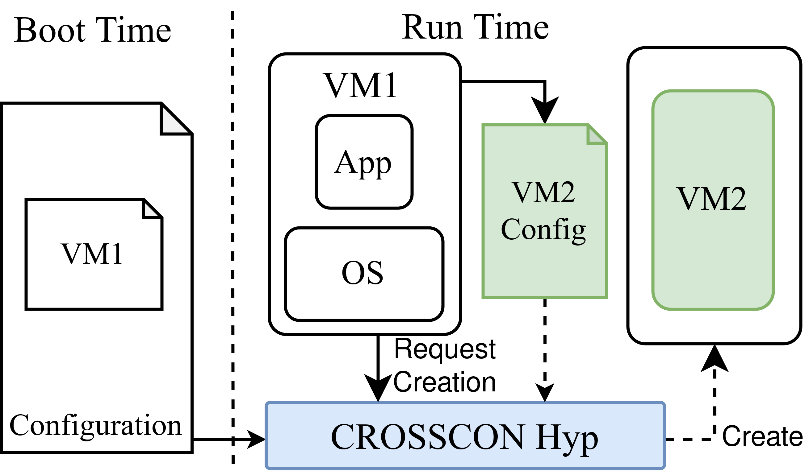
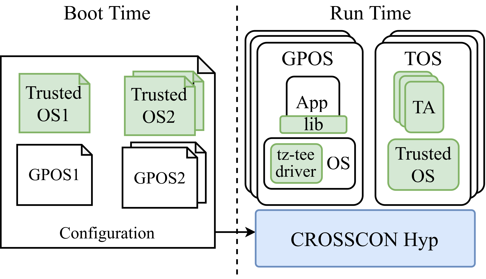

## CROSSCON Hypervisor - A Lightweight Hypervisor

Here you can find the initial version of the _CROSSCON Hypervisor_:  an Hypervisor developed as part of the [CROSSCON project](https://crosscon.eu/).  The repository contains an overview of the CROSSCON Hypervisor, featuring support for QEMU virt. For detailed description of the CROSSCON Hypervisor, please refer to Section 3.2 on the deliverable [D3.1: CROSSCON Open Security Stack Documentation ‐ Draft.](https://crosscon.eu/library/deliverables) This repository is part of the deliverable D3.2: CROSSCON Open Security Stack - Initial Version.
### Overview

**CROSSCON Hypervisor**, being built upon [Bao](https://github.com/bao-project/bao-hypervisor), is grounded in a lightweight, open-source and static partitioning hypervisor that aims to provide strong isolation and real-time guarantees. Its static partitioning designs targets mixed-criticality systems focusing on isolation for fault-containment and real-time behavior. To implement the static partitioning hypervisor architecture: (i) resources are statically partitioned and assigned at VM instantiation time; (ii) memory is statically assigned using 2-stage translation; (iii) IO is pass-through only; (iv) virtual interrupts are directly mapped to physical ones; and (v) it follows a 1-1 mapping of virtual to physical CPUs (with no need for a scheduler). In addition to the inherited architectural isolation features, CROSSCON Hypervisor also offers microarchitectural-level isolation, implementing mechanisms, such as cache coloring, to maintain the isolation of shared resources such as last‐level caches. However, the static partitioning hypervisor design come with its own set of challenges that limit their applicability in IoT systems. Such limitations encompass (i) the absence of dynamic VM creation and management, and (ii) the incapacity to deliver per‐VM TEE services. These challenges will be addressed by enhancing the static partitioning design of the Bao.

**Dynamic-VM feature:**
For dynamic VM, the CROSSCON Hypervisor aims to provide multiple VMs executing concurrently on a single CPU. For this, CROSSCON  Hypervisor leverage VM-stack mechanism detailed in D3.1. Additionally, to enable the creation of new VMs during run-time VM execution, VMs need to access to the hypervisor interface that enables them to send a config file to the hypervisor, i.e., through the VM create hypercall. The CROSSCON Hypervisor then parses this file to instantiate the new child VM.  After this, the hypervisor proceeds to instantiate the child VM, while removing all resources, except for the physical CPUs, from the parent VM. This process, illustrated in Figure 1, ensures the integrity and isolation of each VM, crucial for system security.

    

Figure 1: Diagram for Dynamic VM creation.

Dynamic VMs require that a CROSSCON Hypervisor driver on the host OS interacts with the CROSSCON Hypervisor through the CROSSCON Hypervisor hypervisor call interface. This interface serves three main objectives: VM Creation, VM Destruction, and VM Invocation. For more detailed explanation refer to D3.1.

**Per-VM TEE feature:**

For Per-VM TEE feature, the CROSSCON Hypervisor aims to host trusted OSes, that typically rely on TEE technologies, within a VM. In addition, this features allows moving from a single trusted OS in the secure world to multiple trusted OS VMs running in the normal world. Similar to the Dynamic-VM feature, for per-VM TEE support, CROSSCON Hypervisor requires VM-stack mechanism to link/bind a GPOS VM to a Trusted OS. Figure 2 illustrates how the system establishes per VM TEEs. At boot-time the hypervisor reads the configuration file to establishe multiple GPOS/Trusted OS pairs.

    

Figure 2: Per VM TEEs.

During the CROSSCON project, OP-TEE has been integrated with CROSSCON Hypervisor to execute within VMs in both Arm and RISC-V. This feature enhances security by enabling per-VM TEE services and splitting a single TEE system into multiple isolated TEEs. For more detailed explanation about this process refer to D3.1.

**NOTE**: This is work in progress! Don't expect things to be complete. Use at your own risk.

### Supported Platforms
The full list of supported (and work in progress) platforms is presented below:

**Armv8-A**

- [x]  QEMU virt
- [ ]  Raspberry Pi 4
- [ ]  Xilinx Zynq UltraScale+ MPSoC ZCU102
- [ ]  Xilinx Zynq UltraScale+ MPSoC ZCU104
- [ ]  Ultra96 Zynq UltraScale+ ZU3EG
- [ ]  NXP MCIMX8QM-CPU
- [ ]  NVIDIA Jetson TX2
- [ ]  96Boards HiKey 960
- [ ]  NXP MCIMX8M-EVK (Armv8-A) - soon
- [ ]  96Boards ROCK960 (Armv8-A) - wip

**RISC-V**
- [x]  QEMU virt (rv64)
- [ ]  Rocket w/ H-extension (rv64) - soon

###  CROSSCON Hypervisor configuration

During the boot time, CROSSCON Hypervisor initiates the VMs setup by reading a configuration file. This file defines various properties for each VM, such as the number of cores, size, and optionally, the location of memory regions and VM devices. To see understand the configuration process please refer to: [Bao Configuration]([https://github.com/bao-project/bao-docs/blob/feat/bao-classic_config_guests/source/bao_hyp/config.rst](https://github.com/bao-project/bao-docs/blob/feat/bao-classic_config_guests/source/bao_hyp/config.rst))

[Should we show how to configure each feature? To provide both features there is anything that varies in configurations? There is any document explaining the configuration process? (If yes we could point to there)]?????

### Prerequisites
We assume that you are following the instructions on a PC with a working setup of Ubuntu or Debian OS.
Before you jump to Demos you need to install each Tool in the following list:

| Tool                    | Version |
| ----------------------- | ------- |
| arm-none-eabi-gcc       | 11.3.1  |
| aarch64-none-elf-gcc    | 11.2.1  |
| riscv64-unknown-elf-gcc | 10.2.0  |
| make                    | 4.2.1   |
| dtc                     | 1.5.0   |
| gcc                     | 9.3.0   |
| mkimage                 | 20.10   |
| cmake                   | 3.20.0  |
| ninja                   | 1.10.1  |

### Demos

### References
4. Bruno Sá, José Martins and Sandro Pinto. "**A First Look at RISC-V Virtualization from an Embedded Systems Perspective**". To be published, 2021. [https://arxiv.org/abs/2103.14951](https://arxiv.org/abs/2103.14951)

5. José Martins and Sandro Pinto. "**Static Partitioning Virtualization on RISC-V**". In RISC-V Summit, virtual, 2020.

6. José Martins and Sandro Pinto. "**Bao: a modern lightweight embedded hypervisor**". In Proceedings of the Embedded World Conference, Nuremberg, Germany, 2020.

7. José Martins, Adriano Tavares, Marco Solieri, Marko Bertogna, and Sandro Pinto. "**Bao: A Lightweight Static Partitioning Hypervisor for Modern Multi-Core Embedded Systems**". In Workshop on Next Generation Real-Time Embedded Systems (NG-RES 2020). Schloss Dagstuhl-Leibniz-Zentrum für Informatik. 2020. [https://drops.dagstuhl.de/opus/volltexte/2020/11779/](https://drops.dagstuhl.de/opus/volltexte/2020/11779/)

### Community Resources

Project website:
- [https://crosscon.eu/](https://crosscon.eu/)

Source code:
- [https://github.com/crossconhyp-project/crossconhyp-hypervisor.git](https://github.com/crossconhyp-project/crossconhyp-hypervisor.git)
- [git@github.com](mailto:git@github.com):crossconhyp-project/crossconhyp-hypervisor.git

### Acknowledgments
The work presented in this repository is part of the [CROSSCON project](https://crosscon.eu/) that received funding from the European Union’s Horizon Europe research and innovation programme under grant agreement No 101070537.

